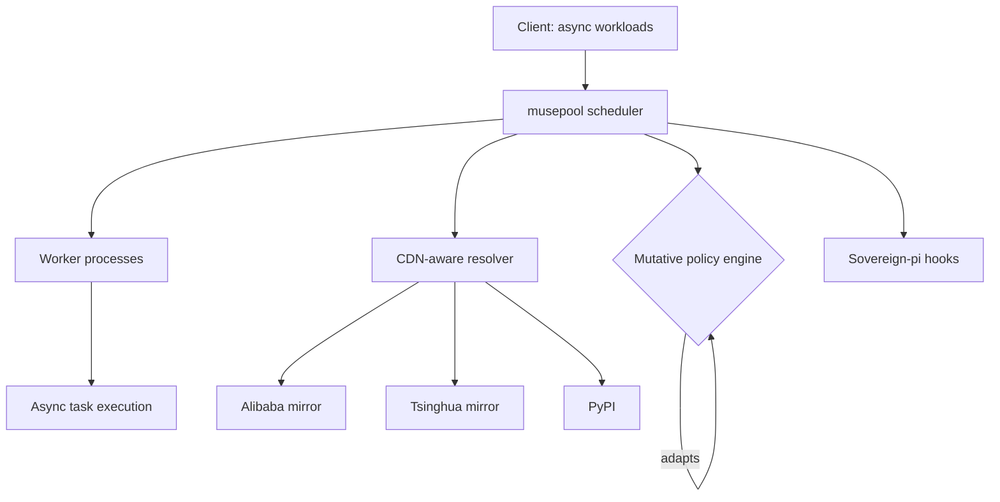

<div align="right">

[](https://github.com/toxicwind/musepool/stargazers)
[](https://github.com/toxicwind/musepool)
[](https://www.python.org/)

</div>

# musepool

> **Async-aware process pool with mutative scheduling, CDN-aware package resolution, and sovereign-pi integration hooks.**

`musepool` is a process pool built for the way modern Python actually runs: cooperative async workloads that still need true parallelism, scheduling that adapts instead of standing still, and environments where the package index is *not* always PyPI.

---

> [!NOTE]
> **Early development.** This repository currently holds the project charter and roadmap — the implementation is on the way. Star ⭐ and watch to follow along, or open an issue/PR if you want to help shape the design.

---

## ✨ Design goals

- 🌐 **CDN-aware package resolution** — resolve against the mirror that actually serves you: Alibaba, Tsinghua, or PyPI
- 🔄 **Mutative scheduling** — the scheduler reshapes its own strategy as workload patterns emerge, instead of locking into one policy at startup
- ⚡ **Async-aware process pool** — first-class support for async workloads across real OS processes, not just threads wearing a trench coat
- 🔌 **Sovereign-pi hooks** — integration points for the sovereign-pi stack, so pool events and lifecycle can drive (and be driven by) local agent infrastructure
- 🐍 **Python 3.12+ primary** — built for the modern runtime, with an AST-compatibility fallback path for 3.11 and 3.8

---

## Intended architecture



1. **Scheduler** — owns the process pool and the task queue.
2. **Mutative policy engine** — observes throughput/latency and mutates scheduling policy at runtime.
3. **CDN-aware resolver** — picks the fastest reachable package index per install.
4. **Sovereign-pi hooks** — publish pool lifecycle events into the sovereign agent mesh.

---

## 🚀 Getting started

```bash
git clone https://github.com/toxicwind/musepool.git
cd musepool
```

Implementation is in progress — the package is not yet published to PyPI. Once the first release lands, installation will be the usual:

```bash
pip install musepool
```

Check the [issues](https://github.com/toxicwind/musepool/issues) for the implementation roadmap and what's up for grabs.

---

## ⚙️ Configuration

Planned configuration surface (subject to change as the implementation lands):

- **Mirrors** — ordered list of package indexes (Alibaba, Tsinghua, PyPI) with health-based failover
- **Scheduler policy** — initial policy + mutation bounds for the mutative engine
- **Sovereign-pi** — hook endpoints for lifecycle events

---

## 🛠️ Contributing

This is the best time to get involved — the design is still being written. Open an issue to propose a scheduling policy, a resolver strategy, or a sovereign-pi integration point, then send a PR. Keep it Python 3.12-first and async-native.

---

## 📄 License & security

**License:** no `LICENSE` file has been committed yet — licensing will be declared with the first code release.

**Security:** `musepool` will execute third-party code in worker processes by design. The roadmap includes process isolation boundaries and a responsible-disclosure path; until the first release, report concerns via a private message to the maintainer rather than a public issue.

---

<p align="center">
  <strong>A pool that learns how to schedule itself.</strong>
</p>
